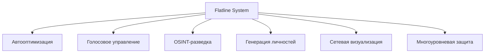

# 🚀 Flatline System - Ultimate Cyber Operations Platform


**Flatline System** - это всеобъемлющая киберпанк-платформа для комплексных операций в цифровом пространстве, сочетающая передовые нейросетевые технологии, продвинутые инструменты разведки и многоуровневую систему анонимизации.



## 🌟 Ключевые особенности

- **Контекстное управление** через естественный язык (200+ команд)
- **Автооптимизация** под любое оборудование (от Raspberry Pi до серверных GPU)
- **Голосовая интеграция** с клонированием голоса и синтезом речи
- **3D-визуализация сетей** в стиле игры Hacknet
- **Многоуровневая система защиты ICE** с физическим уничтожением угроз
- **Автономное самообновление** нейросетей и кодовой базы
- **Расширенная маскировка** под любые устройства и ОС

## 📂 Полная структура проекта

### Основные компоненты системы

```plaintext
📁 FLATLINE-SYSTEM/
│
├── 📁 CORE/ - Ядро системы
│   ├── 📄 ORCHESTRATOR.PY - Главный диспетчер задач
│   ├── 📄 NEURO_COMMANDER.PY - NLP-интерфейс (200+ команд)
│   ├── 📄 ADAPTIVE_OPTIMIZER.PY - Автооптимизация под оборудование
│   │
│   ├── 📁 WEB_INTERFACE/ - Веб-управление
│   │   ├── 📄 API_SERVER.PY (порт 5000)
│   │   ├── 📄 WEB_UI.PY (порт 8000)
│   │   └── 📁 STATIC/ - CSS/JS/Изображения
│   │
│   ├── 📁 AI_TIERS/ - Иерархия нейросетей
│   │   ├── 📁 HEAVY/ - Мощные модели (XWin-70B, SaukeraUT-130B)
│   │   ├── 📁 LIGHT/ - Оптимизированные модели
│   │   ├── 📁 VOICE/ - Голосовые модели (Whisper, XTTS-2)
│   │   └── 📁 MICRO/ - Микро-модели для слабого железа
│   │
│   ├── 📁 NETWORK_VISUALIZER/ - 3D-визуализация сетей
│   │   ├── 📄 HACKNET_ENGINE.PY
│   │   └── 📄 TOPOLOGY_ANALYZER.PY
│   │
│   ├── 📁 CLAYMAN/ - Система маскировки
│   │   ├── 📄 DEVICE_MIMICRY.PY - Маскировка под устройства
│   │   ├── 📄 OS_GHOST.PY - Смена ОС-отпечатков
│   │   └── 📄 PROCESS_SIMULATOR.PY - Эмуляция процессов
│   │
│   ├── 📁 VOICE_OPS/ - Голосовые операции
│   ├── 📁 DARKNET/ - Tor/I2P интеграция
│   ├── 📁 INTEL/ - Система разведки
│   ├── 📁 ACCOUNT_OPS/ - Управление аккаунтами
│   ├── 📁 MAIL_ATTACKS/ - Почтовые атаки
│   ├── 📁 ICE/ - Многоуровневая защита
│   ├── 📁 SELF_UPGRADE/ - Система самообновления
│   └── 📁 KALI_INTEGRATION/ - Интеграция с Kali Linux
│
├── 📁 DATA/ - Хранилище данных
│   ├── 📁 MODELS/ - Нейросетевые модели
│   ├── 📁 DEVICE_PROFILES/ - База устройств
│   │   ├── ANDROID/ - 50+ профилей смартфонов
│   │   ├── IOS/ - 30+ профилей iPhone
│   │   ├── WINDOWS/ - 20+ версий Windows
│   │   ├── LINUX/ - 15+ дистрибутивов
│   │   └── MACOS/ - 10+ версий macOS
│   │
│   ├── 📁 DOCUMENT_TEMPLATES/ - База документов
│   │   ├── PASSPORTS/ - 120 стран
│   │   ├── DRIVING_LICENSES/ - 80 стран
│   │   └── ID_CARDS/ - 100 стран
│   │
│   ├── 📁 INTEL_SOURCES/ - Базы OSINT
│   └── 📁 PERSONA_TEMPLATES/ - Шаблоны личностей
│
├── 📁 MODULES/ - Пользовательские модули
├── 📁 SYSTEM/ - Системные скрипты
│   ├── 📄 INSTALL.SH - Умный установщик
│   ├── 📄 START.SH - Адаптивный запуск
│   ├── 📄 WEB_START.SH - Запуск веб-интерфейса
│   └── 📄 REPAIR.SH - Самовосстановление
│
├── 📄 VANISH.PY - Экстренное удаление следов
└── 📄 CONFIG.JSON - Основной конфиг
```

## 🛠️ Детальное описание ключевых функций

### 1. Умная оптимизация оборудования
**Файл:** `core/adaptive_optimizer.py`  
Адаптирует работу системы под доступные ресурсы:
- Автоматически переключается между уровнями нейросетей
- Отключает тяжелые модули при нехватке RAM/VRAM
- Использует квантованные модели для слабых GPU
- Оптимизирует параллельные задачи для многоядерных CPU

```python
def optimize_for_hardware():
    if ram < 4:  # Режим для Raspberry Pi
        disable_module("heavy_ai_tier")
        use_quantized_models()
    elif vram < 8:  # Режим для средних GPU
        throttle_heavy_models()
    else:  # Режим максимальной производительности
        enable_all_features()
```

### 2. Система маскировки Clayman
**Файл:** `core/clayman/device_mimicry.py`  
Позволяет системе имитировать различные устройства и ОС:

```python
def emulate_android_device(device_model="samsung_galaxy_s23"):
    profile = device_profiles['android'][device_model]
    set_mac(profile['mac'])
    spoof_user_agent(profile['user_agent'])
    simulate_processes(profile['processes'])
    adjust_tcp_params(profile['tcp_signature'])
```

**Поддерживаемые профили:**
| **Тип устройства**      | **Примеры**                     | **Особенности**                          |
|-------------------------|---------------------------------|------------------------------------------|
| **Смартфоны Android**   | Samsung Galaxy S23, Pixel 7     | Эмуляция процессов, сигнатуры сети      |
| **iPhone**              | iPhone 15 Pro, iPhone SE        | iOS-специфичные заголовки, поведение     |
| **Windows PC**          | Win 11, Win 10, Win Server      | Эмуляция системных процессов, реестра   |
| **MacOS**               | MacBook Pro M2, iMac            | macOS-специфичные сетевые сигнатуры     |
| **Linux серверы**       | Ubuntu, CentOS, Debian          | Эмуляция серверных процессов            |
| **IoT устройства**      | Умные камеры, роутеры           | Специфичное сетевое поведение           |

### 3. Автономное самообновление
**Файл:** `core/self_upgrade/neuro_updater.py`  
Система автоматически обновляет нейросети и код:

```python
def update_model(model_name):
    # Поиск последней версии на HuggingFace Hub
    latest_version = huggingface.get_latest_version(model_name)
    
    # Плавное обновление с сохранением бэкапов
    download_model(model_name, latest_version)
    validate_model(model_name)
    switch_to_new_version(model_name)
    
    # Откат при неудачной проверке
    if not test_model(model_name):
        rollback_to_previous(model_name)
```

### 4. 3D-визуализация сетей
**Файл:** `core/network_visualizer/hacknet_engine.py`  
Создает интерактивные 3D-карты сетей в стиле игры Hacknet:

```python
def generate_network_map(scan_results):
    map_data = {
        'nodes': [],
        'connections': []
    }
    
    for device in scan_results:
        threat_level = threat_predictor.calculate(device)
        node = {
            'id': device.ip,
            'type': device.type,
            'threat': threat_level,
            'os': device.os,
            'position': generate_3d_position()
        }
        map_data['nodes'].append(node)
    
    return render_3d_scene(map_data)
```

### 5. Многоуровневая защита ICE
**Файл:** `core/ice/level_3_black.py`  
Крайние меры защиты при физической угрозе:

```python
def activate_black_ice():
    # Уничтожение данных
    wipe_disks(passes=35, method='gutmann')
    
    # Повреждение оборудования
    overheat_cpu(target_temp=120)
    flash_corrupted_bios()
    
    # Контрмеры в сети
    deploy_counter_worm(attacker_ip)
    dox_attacker(attacker_info)
```

## ⚙️ Установка и запуск

### Требования
- **Минимальные:** 4-ядерный CPU, 4GB RAM, 2GB VRAM, Kali Linux 2024+
- **Рекомендуемые:** 8+ ядер CPU, 32GB RAM, 24GB VRAM, NVIDIA GPU

### Быстрый старт
```bash
# Клонирование репозитория
git clone https://github.com/flatline-system/core.git
cd core

# Установка
sudo ./system/install.sh --full

# Запуск системы с веб-интерфейсом
./start.sh
```

### Умный установщик (install.sh)
```bash
#!/bin/bash
# Проверка системы
check_kali_version
check_dependencies

# Установка пакетов
install_system_packages
install_python_deps

# Загрузка нейросетей
download_models --all --quantized

# Настройка ядра
apply_kernel_patches
configure_network

# Проверка целостности
run_integrity_check

# Запуск авторемонта при необходимости
if [ $? -ne 0 ]; then
    ./system/repair.sh --auto
fi

# Финал установки
echo "Установка завершена! Запуск: ./start.sh"
```

## 📊 Сравнение с конкурентами

| **Функция**               | **Flatline System**          | **Конкуренты**               |
|---------------------------|------------------------------|------------------------------|
| **Контекстное управление** | 200+ команд на ЕЯ           | Ограниченные скрипты         |
| **Адаптивность**          | Работает от RPi до серверов  | Требует мощное железо        |
| **Маскировка**            | 100+ устройств и ОС         | Базовая смена MAC/IP         |
| **Автообновление**        | Обновление нейросетей на лету| Ручные обновления            |
| **Визуализация**          | 3D Hacknet-стиль + ИИ        | Статичные 2D схемы           |
| **Защита**                | Физическое уничтожение угроз | Блокировка подключений       |
| **Голосовой интерфейс**   | Клонирование + синтез        | Отсутствует                  |

## ⚠️ Ответственное использование

**Flatline System** предназначен исключительно для:
- Тестирования на защищенных полигонах с разрешения владельца
- Академических исследований в области кибербезопасности
- Тренировок специалистов по этичному хакингу


---
**Flatline System** © 2024 - Эволюция кибер-операций
